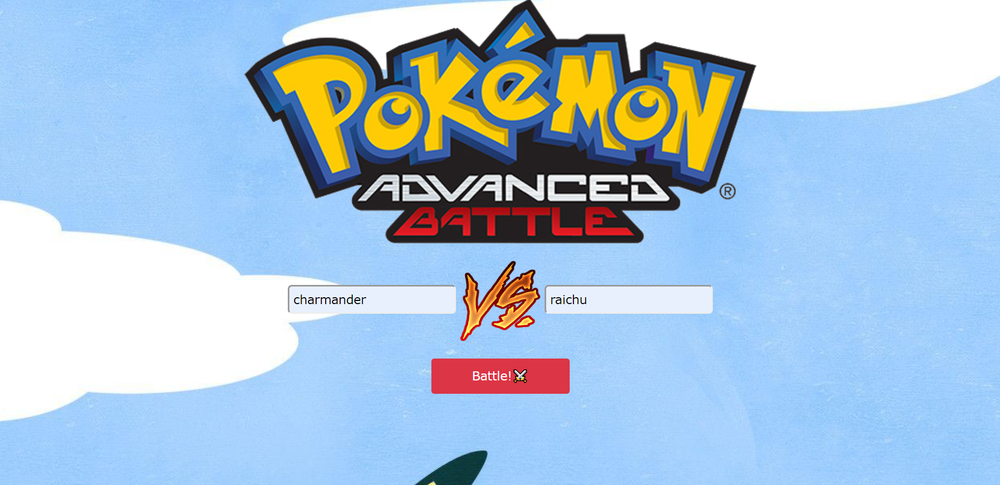
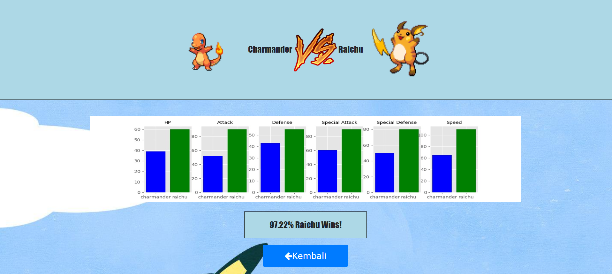
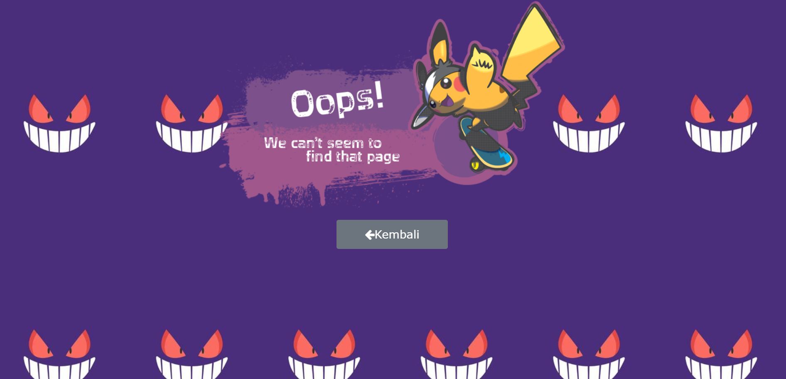

# Machine Learning Exam

#

                  

### **Soal 3 - Pokemon Battle**

Disediakan __beberapa dataset__ seputar data spesies Pokemon beserta history pertandingan antar Pokemon. File **_pokemon.csv_** berisi data lengkap 800 spesies Pokemon, sedangkan file _**combats.csv**_ berisi data historis duel Pokemon beserta pemenangnya. Unduh dataset dari repo ini: [klik sini](./Dataset_3) atau langsung dari sumbernya: [klik sini](https://www.kaggle.com/sekarmg/pokemon).

Dengan dataset tersebut, dibuat sebuah __aplikasi Flask__ berisi model machine learning (model *Logistic Regression*) yang dapat memprediksi pemenang dari duel Pokemon. Aplikasi yang dibuat harus memenuhi syarat minimal berikut:

1. Jalankan file _**backend.py**_.

2. Run **localhost:5000** di web brwser. Akan tampil halaman utama:
    

3. Jalankan tombol **battle** untuk melihat prediksi. Screenshot tampilan halaman hasil:
    

4. Apabila tidak ditemukan, maka akan menuju ke halaman **error** seperti di bawah ini:
    

### **_Enjoy!_**

                  

#

#### Albertus Rianto Wibisono ✉ _albertusrian95@gmail.com_

[Instagram](https://www.instagram.com/rian__wibisono) | 
[LinkedIn](https://www.linkedin.com/in/albertusrian95/) |
[GitHub](https://www.github.com/RiantoWibisono)